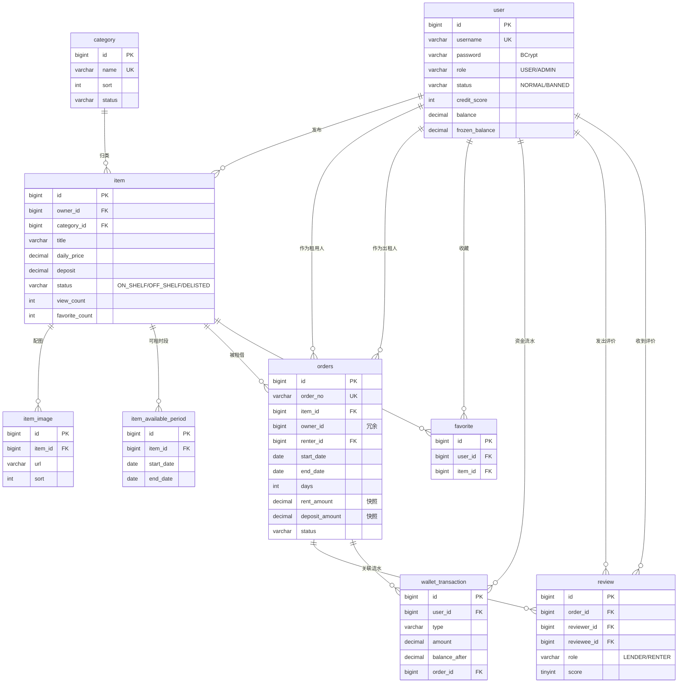

# 租租侠数据库 ER 说明

对应脚本：`docs/db/schema.sql`（建表）、`docs/db/data.sql`（演示数据）
设计依据：`docs/specs/2026-09-17-zuzuxia-底座设计.md` 第 7 节

---

## 1. ER 图

> GitHub 原生渲染 Mermaid，直接在网页上就能看到图。

---

## 2. 每张表的职责

| 表 | 一句话职责 | 容易被误解的点 |
|---|---|---|
| `user` | 所有账号，含管理员 | 管理员不是单独一张表，靠 `role='ADMIN'` 区分 |
| `category` | 物品分类字典 | 管理端可增删改，删除前需确认下面没有物品 |
| `item` | 闲置物品 | **不含"是否租用中"** —— 那是从 `orders` 推导的 |
| `item_image` | 物品的多张配图 | `cover_image` 在 `item` 上单列，这里存其余的 |
| `item_available_period` | 出租人声明的可租日期区间，可多段 | 是"允许被租"的窗口，不是"已被租走"的记录 |
| `orders` | 租借订单与状态流转 | 命名用复数，因为 `order` 是 MySQL 保留字 |
| `wallet_transaction` | 所有资金变动流水 | 只追加不修改，是余额的账本 |
| `review` | 订单完成后的双向评价 | 唯一键 `(order_id, reviewer_id)` 保证一单一人一评 |
| `favorite` | 用户收藏 | 唯一键 `(user_id, item_id)` 防重复收藏 |

---

## 3. 关键设计决策

### 3.1 为什么 `item` 不存"租用中"状态

同一件相机，9 月 1-3 日租给了甲，9 月 10-12 日还能租给乙。如果用一个全局的 `item.status = RENTING` 表示"租用中"，就会错误地把 9 月 10 日之后的申请也挡掉，与"可租时间段"模型自相矛盾。

因此 `item.status` 只表达**出租人的意愿**（上架 / 下架 / 被管理员违规下架），**是否可租**一律通过查询 `orders` 动态判断。

### 3.2 为什么 `orders` 冗余 `owner_id`

查订单列表时要显示"我租出的"和"我租入的"，还要展示物品标题。把 `owner_id` 冗余到订单上，可以用 `renter_id = ? OR owner_id = ?` 一次查完，不必先联 `item` 再过滤。

代价是物品转手时需要同步，但本项目中物品不可转手，所以冗余是安全的。

### 3.3 为什么金额要"下单快照"

`orders` 同时存了 `daily_price`、`deposit_amount`，而 `item` 上也有 `daily_price`、`deposit`。

这是**有意冗余**：出租人下个月把日租金从 80 改成 100，不能让上月已完成的订单金额跟着变。订单必须冻结成交当时的价，否则历史账单和钱包流水全对不上。

### 3.4 唯一索引承担的业务约束

| 索引 | 防住的问题 |
|---|---|
| `user.uk_username` | 用户名重复注册 |
| `orders.uk_order_no` | 单号碰撞 |
| `review.uk_order_reviewer` | 同一订单被同一人重复评价 |
| `favorite.uk_user_item` | 重复收藏 |
| `category.uk_name` | 分类重名 |

> 业务层应先查再插给出友好提示，唯一索引作为**最后一道防线**兜底并发穿透。

### 3.5 索引设计

| 索引 | 服务的查询 |
|---|---|
| `item.idx_category` / `idx_status` | 大厅按分类筛选、只看上架物品 |
| `item.idx_owner` | "我发布的" |
| `item_available_period.idx_item_date` | 判断某日期是否在可租窗口内 |
| `orders.idx_item_period` | **时段冲突检测**（物品 + 日期区间 + 状态）—— 最关键的一条 |
| `orders.idx_renter` / `idx_owner` | 订单中心的两个 tab |
| `wallet_transaction.idx_user_time` | 流水分页，按时间倒序 |
| `review.idx_reviewee` | 信用档案页拉取"收到的评价" |

---

## 4. 订单状态与资金时序

状态流转见设计文档 7.3 节。资金动作时机：

| 节点 | 资金动作 | 产生的流水类型 |
|---|---|---|
| 提交申请 PENDING | 不动钱，仅校验余额是否够（租金 + 押金） | 无 |
| 出租人同意 → RESERVED | 扣租金（托管）+ 冻结押金 | `RENT_PAY`、`DEPOSIT_FREEZE` |
| 拒绝 / 取消 | 退还租金 + 解冻押金 | `RENT_REFUND`、`DEPOSIT_REFUND` |
| 确认归还 → FINISHED | 押金解冻退还租用人；租金入账出租人 | `DEPOSIT_REFUND`、`RENT_INCOME` |
| 管理端介入扣押金 | 从冻结押金扣款给出租人 | `DEPOSIT_DEDUCT`、`RENT_INCOME` |

此外还有一个**与订单无关**的类型：

| 场景 | 资金动作 | 产生的流水类型 |
|---|---|---|
| 用户主动充值 | 增加可用余额 | `RECHARGE` |

`wallet_transaction.type` 共 7 个取值，与 `openapi.yaml` 的 `WalletTransactionVO.type` 枚举、
前端 `utils/constants.js` 的 `WALLET_TYPE_META` **三处必须保持一致**，改动时请同步。

`data.sql` 中的流水已与 `user.balance` / `user.frozen_balance` **严格对账**，可直接用来核对实现是否正确。
